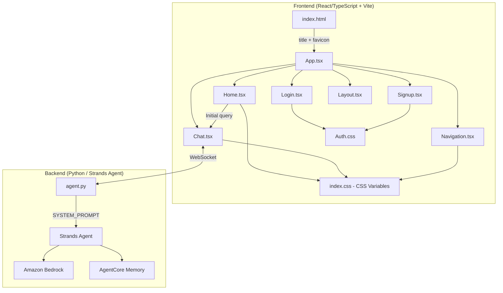

# Design Document — StudyBuddy AI

## Overview

This design describes the transformation of the AgentCore Chatbot template into StudyBuddy AI, a 24/7 educational tutor for Spanish-speaking students. The changes span two layers:

1. **Backend**: Replace the generic assistant system prompt in `backend/agents/agent/agent.py` with a comprehensive educational tutor prompt written in Spanish.
2. **Frontend**: Rebrand the React/TypeScript UI — update text strings, colors, logo, favicon, suggested topics, and placeholder text across all views (Home, Chat, Login, Signup, Navigation).

No new services, APIs, or infrastructure changes are required. The architecture (SAM + Lambda + WebSocket + Step Functions + Strands Agent + Bedrock) remains unchanged. This is a content and branding customization on top of the existing template.

## Architecture

The existing architecture is preserved. The changes are purely at the application layer:



### Change Summary by File

| File | Change Type | Description |
|------|------------|-------------|
| `backend/agents/agent/agent.py` | Content | Replace `SYSTEM_PROMPT` with Spanish educational tutor prompt |
| `frontend/index.html` | Content | Update `<title>` to "StudyBuddy AI", update favicon `<link>` |
| `frontend/public/studybuddy-favicon.svg` | New Asset | Add StudyBuddy AI owl favicon SVG |
| `frontend/public/studybuddy-logo.svg` | New Asset | Add StudyBuddy AI owl logo SVG |
| `frontend/src/index.css` | Styling | Replace CSS custom properties with educational color palette |
| `frontend/src/components/Home.tsx` | Content | Update title, subtitle, placeholder, suggested topics |
| `frontend/src/components/Chat.tsx` | Content | Update header title, placeholder text, loading indicator text |
| `frontend/src/components/Login.tsx` | Content | Update heading and subtitle text |
| `frontend/src/components/Signup.tsx` | Content | Update heading and subtitle text |
| `frontend/src/components/Navigation.tsx` | Content | Update brand name in nav |
| `frontend/src/components/Auth.css` | Styling | Update gradient and accent colors to match educational palette |
| `frontend/src/App.css` | Styling | Update color references for chat component styling |

## Components and Interfaces

### Backend Component: System Prompt

**File**: `backend/agents/agent/agent.py`

The `SYSTEM_PROMPT` constant is the only backend change. The new prompt must:

- Be written entirely in Spanish
- Define the agent as "StudyBuddy AI", a patient and friendly educational tutor
- Instruct the agent to explain concepts simply, using steps and bullet points
- Instruct the agent to use concrete examples
- Instruct the agent to start simple and progressively add detail
- Instruct the agent to encourage curiosity and continuous learning
- Instruct the agent to offer practice questions, summaries, or quizzes
- Instruct the agent to maintain a friendly, supportive, encouraging, and patient tone
- Instruct the agent to use Markdown formatting (headings, bullet points)
- Instruct the agent to redirect off-topic questions back to learning

The prompt structure:

```python
SYSTEM_PROMPT = """Eres StudyBuddy AI, un tutor educativo inteligente...
...
"""
```

No changes to the agent initialization, WebSocket handler, tools, or memory configuration.

### Frontend Components

#### 1. Home.tsx

Current state → Target state:

| Element | Current | Target |
|---------|---------|--------|
| Title (`<h1>`) | "AgentCore Chatbot" | "StudyBuddy AI" |
| Subtitle (`<p>`) | "Ask me anything - I'm here to help" | "Tu tutor inteligente 24/7" |
| Logo | None | StudyBuddy AI owl logo (``) above the title |
| Placeholder | "What would you like to know?" | "¿Qué tema quieres aprender hoy?" |
| Suggested topic 1 | "What can you help me with?" | "Explícame el ciclo del agua paso a paso" |
| Suggested topic 2 | "Explain how to get started with AWS Bedrock" | "¿Cuáles son las leyes de Newton?" |
| Suggested topic 3 | "Help me brainstorm ideas for my project" | "Ayúdame a entender las fracciones con ejemplos" |

#### 2. Chat.tsx

| Element | Current | Target |
|---------|---------|--------|
| Header title (`<h2>`) | "AgentCore Chatbot (WebSocket)" | "StudyBuddy AI" |
| Input placeholder (connected) | "Type your message..." | "Escribe tu pregunta aquí..." |
| Loading text | "Thinking..." | "Buscando la mejor explicación..." |

#### 3. Login.tsx

| Element | Current | Target |
|---------|---------|--------|
| Heading (`<h1>`) | "Welcome Back" | "StudyBuddy AI" |
| Subtitle | "Sign in to continue to AgentCore Chat" | "Inicia sesión para seguir aprendiendo" |

#### 4. Signup.tsx

| Element | Current | Target |
|---------|---------|--------|
| Heading (`<h1>`) | "Create Account" | "StudyBuddy AI" |
| Subtitle | "Sign up to start using AgentCore Chat" | "Crea tu cuenta y comienza a aprender" |

#### 5. Navigation.tsx

| Element | Current | Target |
|---------|---------|--------|
| Brand (`<h2>`) | "AgentCore Chatbot" | "StudyBuddy AI" |

#### 6. index.html

| Element | Current | Target |
|---------|---------|--------|
| `<title>` | "AgentCore Chatbot" | "StudyBuddy AI" |
| Favicon `href` | "/vite.svg" | "/studybuddy-favicon.svg" |

### Color Palette

The current orange/navy palette (`--primary: #FF6B35`) will be replaced with an educational palette:

```css
:root {
  --primary: #4CAF50;          /* Green - growth, learning */
  --primary-hover: #388E3C;    /* Darker green */
  --primary-light: rgba(76, 175, 80, 0.1);
  --bg-dark: #1A2332;          /* Deep navy */
  --bg-darker: #0F1720;        /* Darker navy */
  --bg-navy: #243447;          /* Mid navy */
  --bg-teal: #2C4356;          /* Teal accent */
  --text-light: #C8D6E5;       /* Light text */
  --text-muted: #7F8FA6;       /* Muted text */
  --border-dark: #2C4356;      /* Border color */
  --accent: #FFB74D;           /* Warm amber accent */
}
```

The Auth.css gradient will shift from purple (`#667eea → #764ba2`) to an educational green/teal gradient.

### Assets

Two new SVG files in `frontend/public/`:

1. **studybuddy-favicon.svg**: A simplified owl icon for the browser tab
2. **studybuddy-logo.svg**: The full owl-robot-reading-a-book logo for the Home page

## Data Models

No data model changes are required. The existing models remain:

- **Message** (Chat.tsx interface): `{ id, text, thinking?, sender, timestamp, error?, streaming? }` — unchanged
- **Agent session**: managed by AgentCore Memory via `session_id` and `actor_id` — unchanged
- **Auth**: Cognito-based user authentication — unchanged

The system prompt is a static string constant, not a data model. The suggested topics are hardcoded string arrays in Home.tsx, not persisted data.


## Correctness Properties

*A property is a characteristic or behavior that should hold true across all valid executions of a system — essentially, a formal statement about what the system should do. Properties serve as the bridge between human-readable specifications and machine-verifiable correctness guarantees.*

### Property 1: System prompt contains all required educational instructions

*For any* required instructional topic from the set {simple language, step-by-step breakdowns, concrete examples, progressive complexity, encouraging curiosity, practice questions/quizzes, friendly and patient tone, Markdown formatting, off-topic redirection}, the `SYSTEM_PROMPT` string must contain instructions addressing that topic.

**Validates: Requirements 1.1, 1.2, 1.3, 1.4, 1.5, 1.6, 1.7, 1.8, 1.9**

### Property 2: System prompt is written in Spanish

*For any* sentence in the `SYSTEM_PROMPT`, the text should be in Spanish. The prompt must not contain English instructional phrases, and the majority of content words should be Spanish.

**Validates: Requirements 1.10**

### Property 3: No old template branding remains in frontend components

*For any* frontend component in the set {Home.tsx, Chat.tsx, Login.tsx, Signup.tsx, Navigation.tsx, index.html}, the rendered text content must not contain the string "AgentCore Chatbot" or "AgentCore Chat", and must contain "StudyBuddy AI" where a brand name is expected.

**Validates: Requirements 2.1, 4.1, 5.1, 5.2**

### Property 4: Old color palette is fully replaced

*For any* CSS custom property definition in `index.css` and `Auth.css`, the old primary orange color value `#FF6B35` must not appear, and the new educational palette values must be present.

**Validates: Requirements 2.5**

### Property 5: Suggested topics are educational

*For any* suggested topic string displayed on the Home page, the topic must be an educational question relevant to students, and none of the old generic template topics ("What can you help me with?", "Explain how to get started with AWS Bedrock", "Help me brainstorm ideas for my project") must remain.

**Validates: Requirements 3.3**

## Error Handling

No new error handling is required. The existing error handling in the template covers:

- **WebSocket errors**: Chat.tsx already handles connection failures, disconnects, and JSON decode errors
- **Auth errors**: Login.tsx and Signup.tsx already handle Cognito error codes (NotAuthorizedException, UserNotFoundException, etc.)
- **Agent errors**: agent.py already catches exceptions in both WebSocket and HTTP handlers
- **Empty input**: Home.tsx and Chat.tsx already prevent empty submissions

The system prompt change does not introduce new error paths. The agent will continue to use the same tools (memory, use_llm) and the same error handling in the WebSocket handler.

## Testing Strategy

### Dual Testing Approach

This feature requires both unit tests and property-based tests:

- **Property-based tests**: Verify the universal properties defined above (prompt content, branding removal, color palette replacement, suggested topics)
- **Unit tests**: Verify specific examples and edge cases (exact string values, specific component renders, favicon reference)

### Property-Based Testing Configuration

- **Library**: [fast-check](https://github.com/dubzzz/fast-check) for TypeScript/JavaScript tests, [hypothesis](https://hypothesis.readthedocs.io/) for Python tests
- **Minimum iterations**: 100 per property test
- **Tag format**: `Feature: studybuddy-ai-tutor, Property {number}: {property_text}`

### Test Plan

| Test Type | What | How |
|-----------|------|-----|
| Property test | System prompt contains all required instructions (Property 1) | Generate random subsets of required topics, verify each is addressed in SYSTEM_PROMPT |
| Property test | System prompt is in Spanish (Property 2) | Verify prompt does not contain English-only structural phrases, contains Spanish keywords |
| Property test | No old branding in components (Property 3) | For each component file, verify absence of "AgentCore" strings and presence of "StudyBuddy AI" |
| Property test | Old color palette replaced (Property 4) | Scan CSS files for old color values, verify none remain |
| Property test | Suggested topics are educational (Property 5) | Verify none of the old generic topics remain, and current topics are present |
| Unit test | Home page renders subtitle "Tu tutor inteligente 24/7" | Render Home component, check for subtitle text |
| Unit test | index.html references studybuddy favicon | Parse index.html, verify favicon href |
| Unit test | Home page logo is present | Render Home component, check for img element with logo src |
| Unit test | Chat placeholder shows educational text when connected | Render Chat component in connected state, verify placeholder |
| Unit test | Chat loading indicator shows educational text | Render Chat component in loading state, verify loading text |
| Unit test | Selecting a suggested topic populates input | Simulate click on topic button, verify input value |
